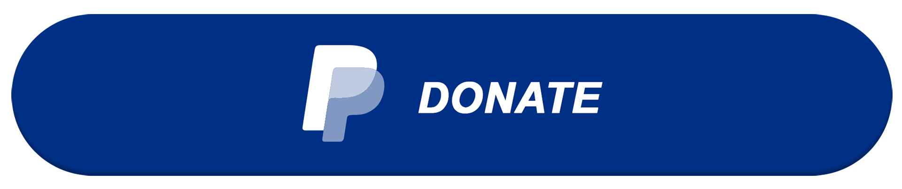

&nbsp;&nbsp;&nbsp;
&nbsp;&nbsp;&nbsp;
&nbsp;&nbsp;&nbsp;
&nbsp;&nbsp;&nbsp;
&nbsp;&nbsp;&nbsp;
&nbsp;&nbsp;&nbsp;
&nbsp;&nbsp;&nbsp;
&nbsp;&nbsp;&nbsp;

  <strong>TL;DR</strong> — Governability via explicit identity, authority, and traceability. ICE is the proof surface. 
  <strong>Proof</strong> — If a system acts, I can reconstruct the why through declared authority + durable state (no inference, no guesswork).

## How I work

Most architectural failures today are not caused by missing features,
but by **unclear responsibility**:
implicit decisions, opaque transitions,
and no reliable way to explain *why* something happened.

I work by making those boundaries explicit.

Systems are defined **from observable behavior backward**:
what happens is visible first;
what is *allowed* to happen is constrained next.
Everything else is implementation detail.

I favor execution paths that are **boring, inspectable, and reconstructible**.
If a system acts, I expect to trace that action
through declared authority and durable state —
without inference or guesswork.

Python is the medium I use to express this discipline:
explicit control flow, lifecycle phases,
and state transitions.
I avoid agent frameworks and implicit schedulers;
they trade convenience for opacity.

> [!TIP]  
> *Models suggest. Code authorizes. State changes only by rule.*

Persistence is treated as part of system semantics.
**SQLite / SQL** and **DuckDB** anchor execution in durable state
and make post-hoc reasoning possible.  
Semantic indexing (*sentence-transformers + FAISS / Chroma*)
may inform decisions,
but never drive control flow.

LLMs are constrained strictly to inference.
They produce proposals — never actions.

> [!IMPORTANT]  
> **ICE** is where this approach is exercised —
> against *real code*, *real state*,
> and *real failure modes*.

<!-- ACTIVITY GRAPH -->

  

  
    This work is long-term, structural, and research-driven. 
    <em>Support sustains continuity, not direction.</em>
  

  

  

